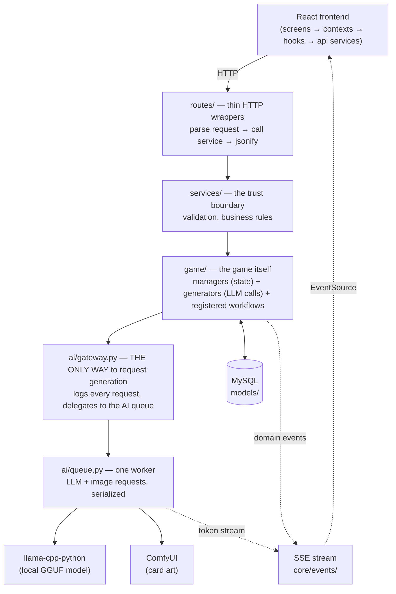
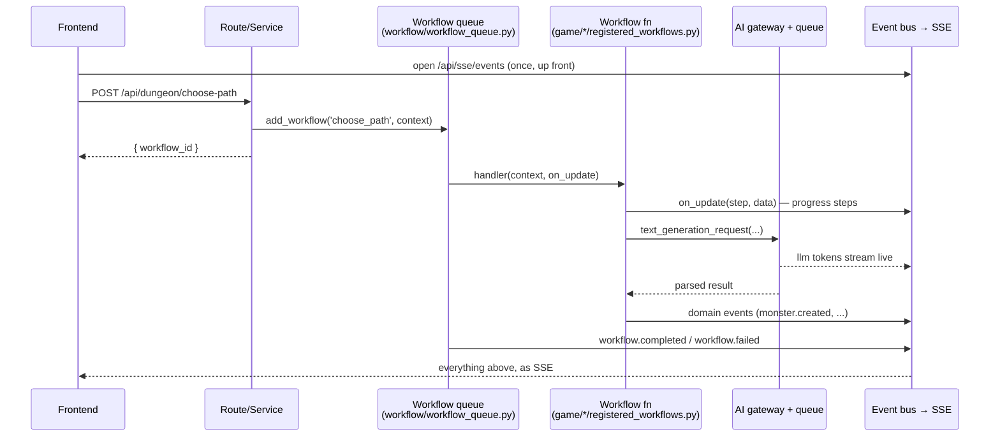

# Architecture

How the pieces fit. The short version: **a thin, strictly-layered Flask
backend orchestrates two AI engines (a local LLM and ComfyUI) through a
single gateway and two queues, streams everything to a React frontend
over SSE — and the LLM only ever picks words, while Python owns every
number.**

Companion docs: [tuning.md](tuning.md) for every knob,
[api/README.md](api/README.md) for the HTTP surface, `CLAUDE.md` at the
repo root for conventions and commands.

## The layers



Layer rules (enforced by review, soon by habit):

1. **Routes** never contain logic — parse, delegate, format. See any file
   in `backend/routes/`.
2. **Services** own validation and business rules; they are the trust
   boundary. Routes trust services; services trust nothing.
3. **Game logic** lives in `backend/game/<domain>/`, split by role:
   - `manager.py` — owns the domain's state (usually in the
     `global_variables` table)
   - `generator.py` — composes prompts and calls the AI gateway
   - `registered_workflows.py` — the async entry points (below)
   - domain extras (`constants.py`, `events.py`, `handlers/`, …)
4. **All AI generation goes through `ai/gateway.py`.** No exceptions.
   Every request becomes a `generation_log` row — the Developer screen's
   AI log table shows every prompt byte-exactly as the model received it.
5. **Below the gateway sits the provider seam** (`ai/llm/providers/`):
   the gateway resolves the player's settings (`game_settings` table over
   env — `ai/llm/provider_settings.py`) and STAMPS provider + model onto
   the log at request time; the processor dispatches on that stamp to
   `local.py` (llama-cpp-python) or `deepseek.py` (cloud API). Queued
   work always finishes on the provider it was requested under, and every
   provider reports the same contract back (text, exact prompt/response
   token counts, model name — the streaming panel and dev log show them).
   Settings are read per request: a panel save applies to the next
   generation, no restart.

## The async workflow model

Expensive actions (generate a monster, choose a path, take a battle turn)
do **not** answer over HTTP. They queue a *workflow* and return
`{ workflow_id }` immediately; results arrive over SSE.



The pieces:

- **`core/workflow_registry.py`** — `@register_workflow` decorator; any
  function in a `registered_workflows.py` file with the signature
  `(context, on_update) -> dict` becomes a queueable workflow. Signature
  and naming are validated at import time (fail fast).
- **`workflow/workflow_queue.py`** — single background worker, DB-backed
  (`game_workflows` table), emits queue/started/completed/failed events.
- **`ai/queue.py`** — a second single worker beneath the gateway that
  serializes actual model calls (one GPU, one model — no concurrency).
- **Step names are a contract.** The frontend's event hooks key off each
  workflow's `on_update` step strings (`useDungeonEvents.js`,
  `useBattleEvents.js`). Renaming a step is a breaking change; treat step
  names and payload keys like an API.

## The event system

- Every event type is declared with a schema in
  `backend/core/events/<domain>_events.py` and registered in
  `core/events/event_registry.py` (fields are filtered to the schema at
  emit time; `send_to_frontend` decides whether SSE carries it).
- The frontend mirrors this: `frontend/src/api/events/*EventHandlers.js`
  registers a handler per event type; components subscribe through
  `useEventSubscription` / `useStreamedGeneration` and update the moment
  their datum arrives (live card reveal, auto-refreshing Sanctuary).
- Catalog: [api/events-and-sse.md](api/events-and-sse.md).

## The referee philosophy (why there are no numbers in prompts)

Combat and resources use **word ladders**, not math
(`game/battle/constants.py`):

- Wellbeing: `fresh → scuffed → wounded → battered → critical → incapacitated`
- Reserves: `brimming → steady → strained → drained → spent`
- Affinity: `wary → familiar → trusting → devoted` (a wary monster acts on
  its own in battle — `game/monster/affinity.py`)
- Danger: `calm → risky → perilous` (the expedition notice's difficulty
  word → code knobs — `game/dungeon/run_context.py`)

The LLM referee narrates an action and answers with a single **word**
(impact: `light/heavy/devastating/heal_*`; cost: `minor/moderate/heavy/
restore_*`). Python maps the word to ladder steps, applies caps, softlock
valves, and fairness guardrails. The same pattern rules growth
(tier words → capped percents), returning monsters, and evolution.
**If you're adding a mechanic: let the LLM choose among words you define,
and let code own what the words do.**

## Context budgets (fitting a game into a small model)

`game/utils/context_limits.py` gives every prompt block a budget that
scales with `LLM_CONTEXT_SIZE`:

- **Required blocks** (party/monster identity) are never truncated;
  their *detail tier* (compact/standard/full) is binned by window size.
- **Flexible blocks** (logs, dialogue, memories) each get a percentage
  share and keep their most recent content when clamped.
- **Rolling summaries** (`game/utils/rolling_summary.py`) condense old
  history via the LLM so long chats and runs stay affordable — raw
  entries are never deleted.

## Directory map

```
backend/
  app.py, run.py, startup.py   Flask factory, runner, subsystem init
  routes/       thin HTTP wrappers (one file per domain)
  services/     validation + business rules (the trust boundary)
  game/         monster/ dungeon/ battle/ chat/ inventory/ memory/ player/ state/ utils/
  ai/           gateway.py, queue.py, llm/ (core, prompts, parser, provider_settings, providers/), comfyui/
  workflow/     the workflow queue + gateway
  core/         events/, config/, utils/, workflow_registry.py
  models/       SQLAlchemy models (one file per table)
  tests/        offline suites (LLM stubbed, test DB) + dev utilities
frontend/src/
  api/          HTTP client, per-domain services, SSE + event handler registry, stores, transformers
  app/          contexts (Navigation, Party, Dungeon, Battle, Event), api-call hooks
  components/   feature components (battle/, dungeon/, cards/, chat/, evolution/, developer/)
  screens/      game/ (the player's screens) + developer/ (dev tools)
  shared/       ui/ (the component library — see ui.md), styles/, constants, hooks
docs/           architecture (this file), tuning.md, api/, design/ (historical), plans/
setup/          interactive environment setup (checks / flows / installation)
tools/          repo tooling (file-size checker, project stats)
```

## Testing

Offline suites in `backend/tests/` run with the **LLM stubbed** and a
**dedicated test database** (`DB_NAME_TEST`, built by `tests/harness.py`).
Each suite is a readable script of `check(...)` assertions with a
`main() -> failure count`; run one with
`python -m backend.tests.test_evolution`, everything via `pytest`, or
from the in-app Developer screen. CI mirrors this (see
`.github/workflows/ci.yml`).
